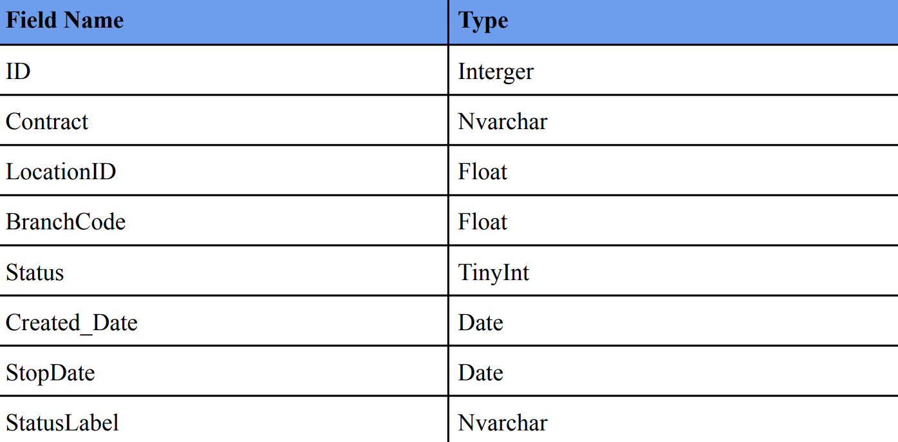
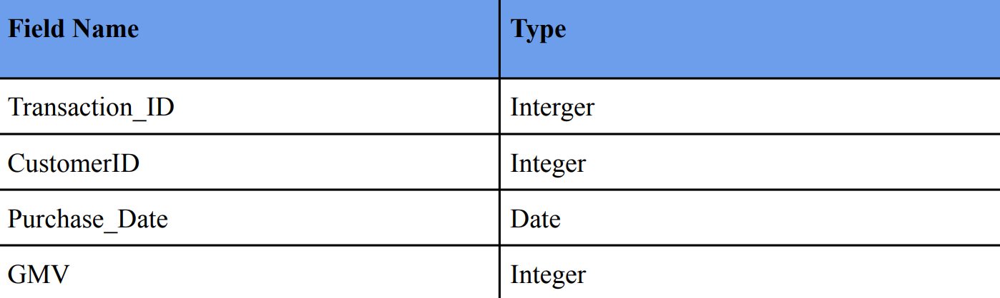
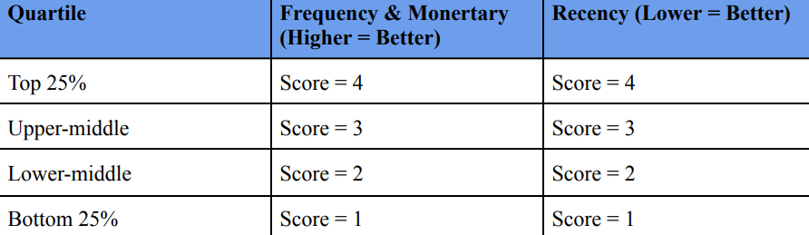
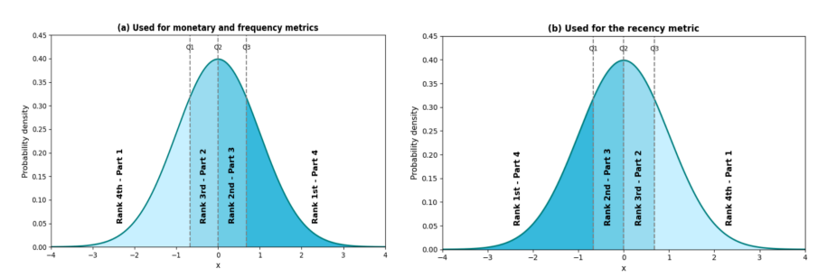
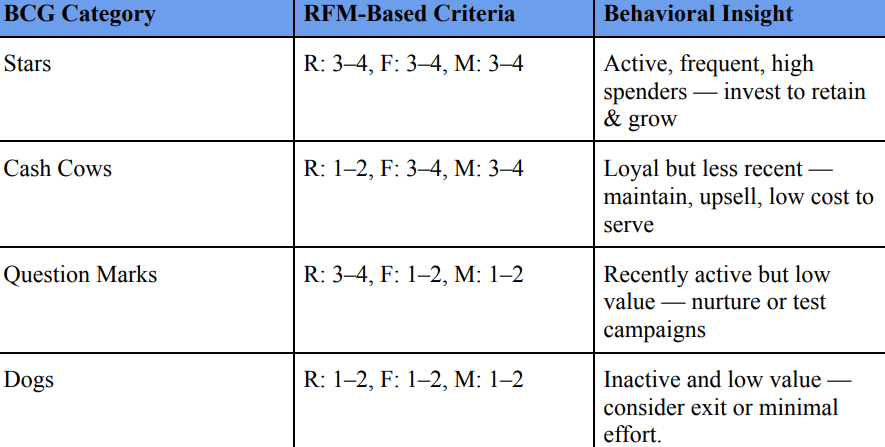
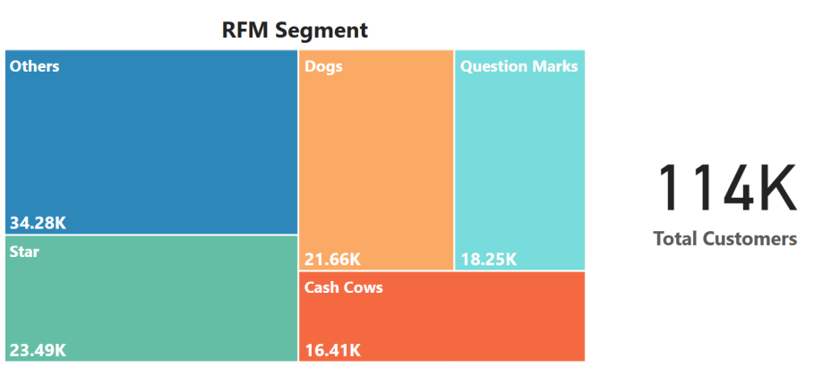
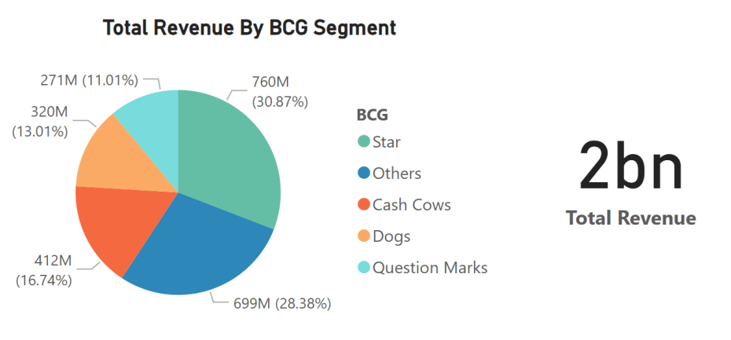
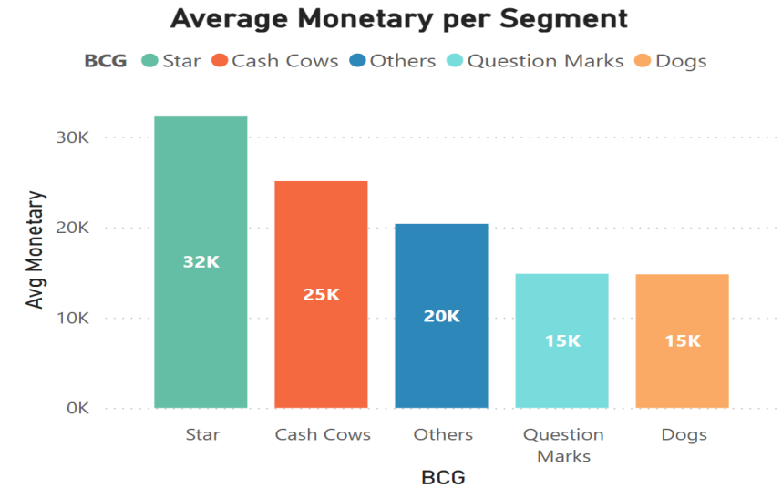

# Customer Segmentation using RFM Analysis & BCG Matrix
## 1. Background and Overview
In today's data-driven business environment, effective customer segmentation is crucial for targeted marketing and retention. In this project, I analyzed a real customer transaction dataset (≈**114,000 customers**) to address the company's lack of strategic segmentation. Previously, marketing efforts were broad and inefficient – high-potential customers weren’t specifically targeted, and medium-value customers at churn risk were not being proactively managed. My goal was to develop an actionable segmentation framework to identify top-tier customers, flag at-risk groups, and optimize marketing spend. 

To achieve this, I implemented a Recency-Frequency-Monetary (RFM) analysis combined with business-context adjustments. Each customer's purchasing behavior was quantified (how recently, how often, and how much they buy) and normalized by their time as a customer (tenure) to ensure fair comparisons between new and long-term clients. I then applied quartile-based scoring to rank customers on each metric and mapped these scores to the classic Boston Consulting Group (BCG) matrix categories. This RFM+BCG approach yielded five distinct customer segments – Stars, Cash Cows, Question Marks, Dogs, and Others – providing a multi-dimensional view of customer value and engagement. Ultimately, the segmentation delivers insights to inform data-backed strategies for retention, upselling, reactivation, and efficient resource allocation across the customer base.

## 2. Data Structure Overview
The analysis is based on two primary tables from the customer database: customer_registered and customer_transaction. The customer_registered table provides each customer's sign-up date (contract start date), while customer_transaction logs all purchase transactions (with purchase dates and amounts). The dataset covers all transactions up to **September 1, 2022**, encompassing **114,090** customers and their purchase history. I cleaned and standardized the data using Python (pandas) to ensure consistency (e.g. uniform date formats, removal of duplicates) before analysis. 

  
   
  <em>Figure: customer_registered tables</em>

  
   
  <em>Figure: customer_transaction tables</em>

From these tables, I derived the key RFM metrics for each customer:
- **Recency** – the number of days since the customer's last purchase (as of the analysis date).
- **Frequency** – the number of distinct purchase days (how many separate days the customer made a purchase).
- **Monetary** – the total spending amount (Gross Merchandise Value in VND) by the customer.

To ensure fairness across different customer tenures, I normalized the Frequency and Monetary values by each customer's tenure (years since registration). This prevents newer customers from being unfairly judged simply due to a shorter history. 

Next, I applied quartile-based scoring: using SQL window functions, I ranked all customers by each metric and assigned an RFM score from 1 (lowest quartile) to 4 (highest quartile) for each of Recency, Frequency, and Monetary. (Note: For Recency, a lower value indicates a more recent purchase, so the scoring is inverted – a customer with very recent purchases gets a 4, the highest score.) 

  
   
  <em>Figure: IQR Method</em>

  
   
  <em>Figure: IQR Chart</em>

Using the combination of these three scores, I then classified each customer into a BCG-inspired segment. For example, a customer with high scores in all three metrics is labeled a “Star”, while one with low scores across the board is a “Dog.” A customer with high spend/frequency but low recency is tagged as a “Cash Cow” (historically valuable, but less active lately), and one with high recency but low spend/frequency is a “Question Mark” (new or re-emerging customer with potential). Any customer who did not fit exactly into one of those four profiles was categorized as “Other.” This final segmentation dataset (each customer’s RFM metrics, scores, and assigned segment) formed the foundation for the deep-dive analysis and insights that follow.

  
   
  <em>Figure: BCG Category</em>

## 3. Executive Summary
I identified five distinct customer segments through this RFM-BCG analysis: Stars, Cash Cows, Question Marks, Dogs, and Others. The two highest-value segments – Stars and Cash Cows, together about 35% of the customer base – contribute nearly half of the total revenue, indicating a highly concentrated value pool. In contrast, the two lowest-performing segments (Dogs and Question Marks), which also make up ~35% of customers, generate only ~24% of revenue, highlighting an efficiency gap in a large portion of the customer base. The remaining 30% of customers fall into the intermediate Others category, contributing roughly proportional revenue (28%) to their size. These findings underscore the need to focus retention and loyalty efforts on the high-value groups, while devising targeted tactics to improve or cost-manage the lower-value segments.

This section summarizes the key findings from the RFM-based customer segmentation. By examining customer distribution, revenue contribution, and average monetary value across segments, we can prioritize where to focus marketing, retention, and reactivation efforts.

### 3.1. Segment Distribution
- **Stars**: 23,490 customers (**20.6%** of the customer base)
- **Cash Cows**: 16,410 customers (**14.4%**)
- **Question Marks**: 18,250 customers (**16.0%**)
- **Dogs**: 21,660 customers (**19.0%**)
- **Others**: 34,280 customers (**30.0%**)

The customer base is spread fairly evenly across segments, with no single group dominating in size. The largest is the **Others** segment (**34.28K**), which contains customers with moderate RFM behavior who didn’t fit cleanly into the BCG quadrants. This group presents an opportunity: with deeper segmentation (e.g., by product, region, or channel), we may uncover hidden high-value subgroups.
Meanwhile, **Stars** and **Cash Cows** together account for **35%** customer base. Although they are smaller in number, they are expected to have outsized business impact — a hypothesis that is confirmed in the revenue analysis.

  
   
  <em>Figure: Total Customers Chart</em>

### 3.2. Segment Contribution   
Next, I looked at how much revenue each segment contributes, to gauge their importance in monetary terms. The total revenue (~2,000 million VND) was broken down by segment:

- **Stars**: 760 million VND (**30.87%** of total revenue)
- **Others**: 699 million VND (**28.38%**)
- **Cash Cows**: 412 million VND (**16.74%**)
- **Dogs**: 320 million VND (**13.01%**)
- **Question Marks**: 271 million VND (**11.01%**)

There’s a striking imbalance between customer count and revenue.
**Stars**, while only **20.6%** of customers, generate nearly **30.87%** of total revenue.
**Cash Cows** add another **16.74%**, slightly above their **14.4%** share.
Together, they drive almost **47.61%** of all revenue — a clear signal that they are core value generators.

By contrast, Dogs and Question Marks — together also **35%** of customers — contribute only **24.02%** of revenue. This underperformance highlights a potential inefficiency: many customers, but limited returns.

The Others group contributes **28.38%** of revenue, slightly below its **30%** share of customers. This suggests average performance overall, but also hints at the potential value hidden within the segment.

  
   
  <em>Figure: Total Revenue Chart</em>

### 3.3. Average Monetary per Segment 
Analyzing average revenue per customer further reinforces the value gap:

- **Stars** are by far the highest-value individuals, spending **32K** VND on average — more than double the amount of **Dogs** or **Question Marks**.

- **Cash Cows** follow at **25K** VND, confirming their strong historical value, even with less recent activity.

- **Others** average around **20K** VND, signaling room for deeper exploration.

- **Dogs** and **Question** Marks have the lowest average spend (~**15K** VND), revealing limited value per customer.

These insights show that not all customers are equally valuable. Stars and Cash Cows are efficient revenue generators and deserve high-priority investment. Dogs and Question Marks, in contrast, either require cost-efficient engagement or selective reactivation. Others remain a strategic wildcard — stable in average value, but likely hiding meaningful subsegments that could drive future growth.

  
   
  <em>Figure: Average Monetary Per Segment Chart</em>

## 4. Insight Deep Dive
**Stars & Cash Cows (High-Value Segments)**: These two groups, though only about **35%** of the customers, are responsible for roughly **47%** of revenue. Stars are the most valuable customers on a per-customer basis – on average, a single Star generates significantly more revenue than a typical customer (over twice that of a customer in a low-tier segment). This is because Stars exhibit very frequent purchases, high spending, and very recent activity, which translates directly into outstanding revenue contribution. Cash Cows similarly have a high lifetime value (historically frequent, big spenders), but many have slowed down recently (lower recency). Even so, their average revenue per customer is well above the overall mean, reaffirming their importance. The key insight is that both Stars and Cash Cows “punch above their weight” – they deliver far more revenue than their population share would predict – making them critical to the business. 

**Question Marks & Dogs (Low-Value Segments)**: In stark contrast, the two lowest-performing segments comprise a similarly large chunk (~**35%**) of the customer base but produce only about **one-quarter** of the revenue. Their revenue per customer is the lowest among all segments. Dogs are largely inactive customers with very infrequent purchases and minimal spend – essentially customers with low engagement and low value. Question Marks have made a purchase recently (showing some interest, hence a high recency score), but their overall purchase frequency and total spend remain very low. In effect, neither group is contributing much value individually or collectively. This represents a significant efficiency gap: a large number of customers are yielding relatively little revenue. Without intervention, these segments offer limited return on marketing investment compared to the others. 

**“Others” Segment (Mid-Tier Customers)**: The remaining **30%** of customers fall into the Others category. This group contributes around **28%** of revenue, nearly proportional to its share of customers. These customers have moderate recency, frequency, and monetary values that didn’t place them into one of the four defined BCG quadrants – in other words, they are average performers as a whole (neither extremely high nor extremely low value). However, because this segment is so broad, it likely contains diverse customer profiles. There may be hidden sub-segments within “Others” that have above-average value or distinct behaviors. Identifying those patterns – for example, by further segmenting this group based on product preferences, region, or engagement channel – could uncover new opportunities. The insight here is that “Others” is not a monolith; it warrants further analysis to tease apart any high-potential customers that are currently grouped in this average category.

## 5. Recommendations
To translate these insights into actionable business strategies, I developed targeted recommendations for each customer segment. By aligning marketing and retention efforts with the characteristics of each group, the company can maximize the impact of each customer interaction. Below is a summary of each segment’s profile and the recommended strategic actions:
**Stars**: These customers are active, frequent, and high-spending – essentially the best customers. Strategy: Prioritize retention and continue to delight this segment. For Stars, we should invest in loyalty programs, exclusive perks, and premium offerings to reward their engagement. The goal is to retain and grow these top-tier customers. Even small improvements in their retention or spending can have a big payoff, given their high value. Ensuring Stars feel valued and keeping them engaged will protect a major source of revenue.

**Cash Cows**: These customers are loyal and historically high-spending, but their purchase frequency has declined recently (less recent activity). Strategy: Focus on reactivation and upselling while maintaining cost-efficient service. We recommend targeted re-engagement campaigns to draw Cash Cows back in – for example, personalized reminders highlighting new offerings or the value they’ve enjoyed in the past, and limited-time incentives (discounts or exclusive deals) to prompt a return purchase. Since Cash Cows already have a strong past relationship with the brand, a gentle nudge can revive their activity. The key is to remind them that they are valued and prevent “silent churn.” With minimal outreach cost (automated emails or loyalty calls), we can reignite their purchasing and extend their lifetime value.

**Question Marks**: These customers are new or recently reactivated (very recent purchases) but low frequency and low spending so far. They have shown interest in the product/service, but haven’t yet become regular or high-value buyers. Strategy: Nurture and educate this segment to increase their engagement. The approach is to onboard Question Marks more deeply into our ecosystem and guide them toward higher usage. For example, we can provide how-to guides, usage tips, or tailored product recommendations to help them see more value in what we offer. Coupling this with targeted promotions or introductory offers can encourage more frequent purchases. Essentially, we want to turn Question Marks into repeat buyers: with the right nurturing, some of these customers can graduate into higher-value tiers over time. By tapping into the interest they’ve recently shown, we aim to convert them into the next generation of Stars or Cash Cows.

**Dogs**: These customers are inactive or minimally engaged – they purchase very infrequently and spend little when they do. They haven’t bought anything in a long time, or only did so sporadically with low value. Strategy: Minimize resource expenditure on this group and manage them with low-touch, cost-efficient tactics. Given Dogs’ very low contribution to revenue, the company should limit marketing spend on them. For instance, we might remove them from expensive direct mail or personal sales call lists and instead keep them on inexpensive, automated email campaigns just to stay on the radar. It may even be acceptable to let many of these customers churn naturally. In short, we should not invest heavily in trying to re-engage Dogs – the ROI simply isn’t there. Any retention efforts for this segment should be highly automated and low-cost, ensuring that we aren’t diverting significant resources away from more valuable customers.

**Others**: This segment is a mixed bag of customers who don’t fit neatly into the above categories. They have roughly average recency, frequency, and monetary values, which means some are decent customers and others are lower value. Strategy: Further segment and analyze the “Others” to tailor strategies appropriately. Because this group is so broad, a one-size-fits-all approach is not ideal. We recommend drilling down into this segment to identify distinguishable sub-segments. For example, there may be up-and-coming customers within Others who, with a bit more engagement, could become Stars (these should be targeted with Star-like retention strategies). Conversely, there may be low-value or dormant subgroups within Others that resemble Dogs, which we might handle with scaled-down efforts. By splitting the Others segment into clearer profiles, the company can apply the right tactics to each sub-group. In summary, treat “Others” not as a single segment but as an opportunity for deeper segmentation – this will ensure no valuable customers are overlooked, and marketing resources are allocated efficiently according to each subgroup’s potential.

By implementing these segment-specific strategies, the company can significantly optimize its marketing and retention efforts. The plan directs investments (time, budget, promotions) to where they will yield the highest return – delighting and expanding the best customers, reactivating lapsed but valuable ones, cultivating the newly interested, and economizing on the lowest-value groups. This focused approach is expected to improve overall customer lifetime value, reduce inefficient spend, and increase revenue growth. We now have a clear, actionable roadmap: keep our Stars and Cash Cows loyal and spending, grow the Question Marks, carefully revive the Cash Cows, spend wisely on Dogs, and unravel the “Others” to find new opportunities. With this RFM–BCG segmentation framework in place, marketing and sales teams can make more informed, strategic decisions about how to engage each part of the customer base going forward.

## 6. Files Included  
| File | Description |
|------|-------------|
| `rfm_analysis.ipynb` | Python code for data cleaning & segmentation |
| `rfm_report.pdf` | Full visual report |
| `rfm_scoring.sql` | SQL queries for RFM scoring |
| `images/` | Charts & visualizations used in the report |
