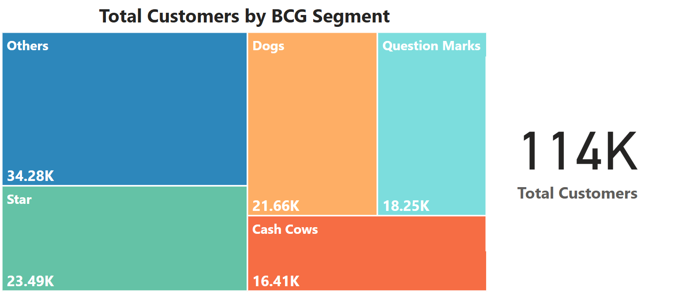

# Customer Segmentation using RFM Analysis & BCG Matrix 

## Project Overview
[1. Background and Overview](#1-background-and-overview)  
[2. Data Structure Overview](#2-data-structure-overview)  
[3. Executive Summary](#3-executive-summary)  
  [3.1. Segment Distribution](#31-segment-distribution)  
  [3.2. Segment Contribution](#32-segment-contribution)  
  [3.3. Average Monetary per Segment](#33-average-monetary-per-segment)  
[4. Insight Deep Dive](#4-insight-deep-dive)  
  [4.1. High-Value Segments: Stars & Cash Cows](#41-high-value-segments-stars--cash-cows)  
  [4.2. Low-Value Segments: Question Marks & Dogs](#42-low-value-segments-question-marks--dogs)  
  [4.3. Mid-Tier Segment: Others](#43-mid-tier-segment-others)  
[5. Recommendations](#5-recommendations)  
[6. Files Included](#6-files-included)  

## 1. Background and Overview
In today's data-driven business environment, effective customer segmentation is crucial for targeted marketing and retention. In this project, I analyzed a real customer transaction dataset (≈**114,000 customers**) to address the company's lack of strategic segmentation. Previously, marketing efforts were broad and inefficient – high-potential customers weren’t specifically targeted, and medium-value customers at churn risk were not being proactively managed. My goal was to develop an actionable segmentation framework to identify top-tier customers, flag at-risk groups, and optimize marketing spend. 

To achieve this, I implemented a Recency-Frequency-Monetary (RFM) analysis combined with business-context adjustments. Each customer's purchasing behavior was quantified (how recently, how often, and how much they buy) and normalized by their time as a customer (tenure) to ensure fair comparisons between new and long-term clients. I then applied quartile-based scoring to rank customers on each metric and mapped these scores to the classic Boston Consulting Group (BCG) matrix categories. This RFM+BCG approach yielded five distinct customer segments – Stars, Cash Cows, Question Marks, Dogs, and Others – providing a multi-dimensional view of customer value and engagement. Ultimately, the segmentation delivers insights to inform data-backed strategies for retention, upselling, reactivation, and efficient resource allocation across the customer base.

## 2. Data Structure Overview
The analysis is based on two primary tables from the customer database: customer_registered and customer_transaction. The customer_registered table provides each customer's sign-up date (contract start date), while customer_transaction logs all purchase transactions (with purchase dates and amounts). The dataset covers all transactions up to **September 1, 2022**, encompassing **114,090** customers and their purchase history. I cleaned and standardized the data using Python (pandas) to ensure consistency (e.g. uniform date formats, removal of duplicates) before analysis. 

  
   
  <em>Figure: customer_registered tables</em>

  
   
  <em>Figure: customer_transaction tables</em>

From these tables, I derived the key RFM metrics for each customer:
- **Recency** – the number of days since the customer's last purchase (as of the analysis date).
- **Frequency** – the number of distinct purchase days (how many separate days the customer made a purchase).
- **Monetary** – the total spending amount (Gross Merchandise Value in VND) by the customer.

To ensure fairness across different customer tenures, I normalized the Frequency and Monetary values by each customer's tenure (years since registration). This prevents newer customers from being unfairly judged simply due to a shorter history. 

Next, I applied quartile-based scoring: using SQL window functions, I ranked all customers by each metric and assigned an RFM score from 1 (lowest quartile) to 4 (highest quartile) for each of Recency, Frequency, and Monetary. (Note: For Recency, a lower value indicates a more recent purchase, so the scoring is inverted – a customer with very recent purchases gets a 4, the highest score.) 

  
   
  <em>Figure: IQR Method</em>

  
   
  <em>Figure: IQR Chart</em>

Using the combination of these three scores, I then classified each customer into a BCG-inspired segment. For example, a customer with high scores in all three metrics is labeled a **Star**, while one with low scores across the board is a **Dog** A customer with high spend/frequency but low recency is tagged as a **Cash Cow** (historically valuable, but less active lately), and one with high recency but low spend/frequency is a **Question Mark** (new or re-emerging customer with potential). Any customer who did not fit exactly into one of those four profiles was categorized as **Other** This final segmentation dataset (each customer’s RFM metrics, scores, and assigned segment) formed the foundation for the deep-dive analysis and insights that follow.

  
   
  <em>Figure: BCG Category</em>

## 3. Executive Summary
Having segmented the customer base using an RFM-driven BCG matrix, we can now examine the composition and performance of each segment. The goal is to understand how these segments differ in size, revenue contribution, and value per customer, and to derive actionable business insights from these patterns. We categorized ~114,000 customers into five groups – Stars, Cash Cows, Question Marks, Dogs, and Others – which together generated over 2.4 billion VND in the period analyzed. Below, we discuss the key findings, using Chart 1 (Total Customers by Segment), Chart 2 (Total Revenue by Segment), and Chart 3 (Average Monetary Value per Segment) for reference.

### 3.1. Segment Distribution
This section summarizes the key findings from the RFM-based customer segmentation. By examining customer distribution, revenue contribution, and average monetary value across segments, we can prioritize where to focus marketing, retention, and reactivation efforts.
- **Stars**: 23,490 customers (**20.6%** of the customer base)
- **Cash Cows**: 16,410 customers (**14.4%**)
- **Question Marks**: 18,250 customers (**16.0%**)
- **Dogs**: 21,660 customers (**19.0%**)
- **Others**: 34,280 customers (**30.0%**)

The customer base is spread fairly evenly across segments, with no single group dominating in size. The largest is the **Others** segment (**34.28K**), which contains customers with moderate RFM behavior who didn’t fit cleanly into the BCG quadrants. This group presents an opportunity: with deeper segmentation (e.g., by product, region, or channel), we may uncover hidden high-value subgroups.
Meanwhile, **Stars** and **Cash Cows** together account for **35%** customer base. Although they are smaller in number, they are expected to have outsized business impact — a hypothesis that is confirmed in the revenue analysis.

  
   
  <em>Figure: Total Customers Chart</em>

### 3.2. Segment Contribution   
Next, I looked at how much revenue each segment contributes, to gauge their importance in monetary terms. The total revenue (~2,000 million VND) was broken down by segment:

- **Stars**: 760 million VND (**30.87%** of total revenue)
- **Others**: 699 million VND (**28.38%**)
- **Cash Cows**: 412 million VND (**16.74%**)
- **Dogs**: 320 million VND (**13.01%**)
- **Question Marks**: 271 million VND (**11.01%**)

There’s a striking imbalance between customer count and revenue.
Despite accounting for only **20.6%** customers, **Stars** generate nearly **30.87%** of total revenue which is the highest among all groups. **Cash Cows** with **14.4%** of customers, contribute **16.74%**. Combined, they deliver **47.61%** of all revenue, validating their critical business value. 

By contrast, **Dogs** and **Question Marks** — together represent **35%** of customer base but contribute only **24.02%** of revenue, which is a clear underperformance relative to size. Meanwhile, The **Others** group contributes **28.38%** of revenue, slightly below its **30%** share of customers. This suggests average performance overall, but also hints at the potential value hidden within the segment.

  
   
  <em>Figure: Total Revenue Chart</em>

### 3.3. Average Monetary per Segment 
To further understand these patterns, I examined the average revenue per customer in each segment (total segment revenue divided by number of customers in that segment). This metric reveals how much revenue, on average, each customer in a given group contributes, and it reinforces the efficiency insights from the revenue analysis:

- **Stars** are by far the highest-value individuals, spending **32K**VND per customer. Their high spend, high frequency, and recent activity make them the cornerstone of growth.
- **Cash Cows** follow with **25K** VND, confirming their strong historical value, even with less recent activity.
- **Others** average around **20K** VND, suggesting average value but with potential high-performers hidden inside.
- **Dogs** and **Question Marks** have the lowest average spend (~**15K** VND), revealing limited value per customer.

These insights show that not all customers are equally valuable. **Stars** and **Cash Cows** are efficient revenue generators and deserve high-priority investment. **Dogs** and **Question Marks**, in contrast, either require cost-efficient engagement or selective reactivation. Others remain a strategic wildcard — stable in average value, but likely hiding meaningful subsegments that could drive future growth.

  
   
  <em>Figure: Average Monetary Per Segment Chart</em>

## 4. Insight Deep Dive 
### 4.1. High-Value Segments: Stars & Cash Cows
- **Stars & Cash Cows**: These two groups, though only about **35%** of the customers, are responsible for roughly **47%** of revenue. **Stars** are the most valuable customers on a per-customer basis – on average, a single Star generates significantly more revenue than a typical customer (over twice that of a customer in a low-tier segment). This is because **Stars** exhibit very frequent purchases, high spending, and very recent activity, which translates directly into outstanding revenue contribution. **Cash Cows** similarly have a high lifetime value (historically frequent, big spenders), but many have slowed down recently (lower recency). Even so, their average revenue per customer is well above the overall mean, reaffirming their importance. The key insight is that both **Stars** and **ash Cows** “punch above their weight” – they deliver far more revenue than their population share would predict – making them critical to the business. 

### 4.2. Low-Value Segments: Question Marks & Dogs
- **Question Marks & Dogs**: By contrast, the two lowest-performing segments comprise a similarly large chunk (~**35%**) of the customer base but produce only about **one-quarter** of the revenue. Their revenue per customer is the lowest among all segments. **Dogs** are largely inactive customers with very infrequent purchases and minimal spend – essentially customers with low engagement and low value. **Question Marks** have made a purchase recently (showing some interest, hence a high recency score), but their overall purchase frequency and total spend remain very low. In effect, neither group is contributing much value individually or collectively. This represents a significant efficiency gap: a large number of customers are yielding relatively little revenue. Without intervention, these segments offer limited return on marketing investment compared to the others. 

### 4.3. Mid-Tier Segment: Others
- **Others**: The remaining **30%** of customers fall into the Others category. This group contributes around **28%** of revenue, nearly proportional to its share of customers. These customers have moderate recency, frequency, and monetary values that didn’t place them into one of the four defined BCG quadrants – in other words, they are average performers as a whole (neither extremely high nor extremely low value). However, because this segment is so broad, it likely contains diverse customer profiles. There may be hidden sub-segments within **Others** that have above-average value or distinct behaviors. Identifying those patterns – for example, by further segmenting this group based on product preferences, region, or engagement channel – could uncover new opportunities.

## 5. Recommendations
To translate these insights into actionable business strategies, I proposed targeted recommendations for each customer segment. By aligning marketing and retention efforts with the characteristics of each group, the company can maximize the impact of each customer interaction. Below is a summary of each segment’s profile and the recommended strategic actions:

- **Stars**: These are our most engaged and high-spending customers—frequent buyers with strong recent activity and significant monetary value. Strategy: Focus on retention and relationship deepening. To safeguard this high-value segment, the company should offer loyalty-driven initiatives such as tiered reward programs, exclusive early access to products, or premium support services. These customers are already invested—our goal is to keep them emotionally connected and continually delighted. Even marginal improvements in retention or wallet share within this group can yield substantial revenue gains. Protecting Stars from attrition should be a top strategic priority.

- **Cash Cows**: Cash Cows are historically profitable customers with high lifetime value, although their recent activity has slowed. Strategy: Reignite engagement and maintain loyalty through cost-effective campaigns. This segment is ripe for personalized reactivation efforts—such as curated offers, “we miss you” messages, or re-engagement journeys that remind them of past value. Given their prior commitment to the brand, a subtle nudge can often revive activity. Automation can help keep engagement costs low while still offering personalized touchpoints. The key is to prevent silent churn and preserve long-term value.

- **Question Marks**: These customers have shown recent interest (high recency) but remain low in frequency and spending.
Strategy: Guide, nurture, and grow. **Question Marks** represent early-stage potential. They may be new, or re-engaged after a long absence. To develop them into higher-value segments, invest in onboarding workflows, tailored product suggestions, and educational content that enhances their experience. Time-sensitive incentives or entry-level loyalty perks can encourage repeat purchases. The objective is to turn curiosity into commitment—some **Question Marks** could evolve into future **Stars** or **Cash Cows** with the right strategic support.

- **Dogs**: **Dogs** are low-value customers with infrequent, low-spend transactions and minimal recent activity.
Strategy: Reduce investment and manage passively. Given their limited return on investment, **Dogs** should be handled with scalable, low-cost outreach—generic emails, occasional promotions, or inclusion in broad campaigns. Active re-engagement may not be justified. It's often more effective to allow these customers to churn naturally than to pursue them aggressively. Retention resources should be preserved for more promising segments.

- **Others**: This segment is a mixed bag of customers who don’t fit neatly into the above categories. They have roughly average recency, frequency, and monetary values, which means some are decent customers and others are lower value. Strategy: Further segment and analyze the **Others** to tailor strategies appropriately. Because this group is so broad, a one-size-fits-all approach is not ideal. We recommend drilling down into this segment to identify distinguishable sub-segments. For example, there may be up-and-coming customers within Others who, with a bit more engagement, could become **Stars** (these should be targeted with Star-like retention strategies). Conversely, there may be low-value or dormant subgroups within **Others** that resemble **Dogs**, which we might handle with scaled-down efforts. By splitting the Others segment into clearer profiles, the company can apply the right tactics to each sub-group. In summary, treat **Others** not as a single segment but as an opportunity for deeper segmentation – this will ensure no valuable customers are overlooked, and marketing resources are allocated efficiently according to each subgroup’s potential.

By implementing these segment-specific strategies, the company can significantly optimize its marketing and retention efforts. The plan directs investments (time, budget, promotions) to where they will yield the highest return – delighting and expanding the best customers, reactivating lapsed but valuable ones, cultivating the newly interested, and economizing on the lowest-value groups. This focused approach is expected to improve overall customer lifetime value, reduce inefficient spend, and increase revenue growth. We now have a clear, actionable roadmap: keep our **Stars** and **Cash Cows** loyal and spending, grow the **Question Marks**, carefully revive the **Cash Cows**, spend wisely on **Dogs**, and unravel the **Others** to find new opportunities. With this RFM–BCG segmentation framework in place, marketing and sales teams can make more informed, strategic decisions about how to engage each part of the customer base going forward.

  
   
  <em>Figure: BCG Matrix: Customer Behavior & Strategy</em>

## 6. Files Included  
| File | Description |
|------|-------------|
| `rfm_analysis.ipynb` | Python code for data cleaning |
| `rfm_report.pdf` | SQL queries for data analysis |
| `rfm_scoring.sql` |  PowerBI report for data visualization |
| `images/` | Charts & visualizations used in the report |
| `rfm_report.pdf` | Full RFM analysis report |
